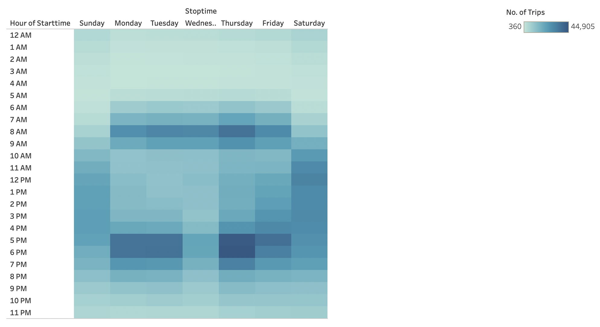

The corresponding visualizations in Tableau are here:
[link to dashboard](https://public.tableau.com/views/CitiBikeChallenge_16461862958220/CitiBike?:language=en-US&:display_count=n&:origin=viz_share_link)

# Overview of the analysis:
The purpose of the analysis is to gain insights on how Citi Bikes are used in New York City, with the intent to create the same experience in Des Moines, Illinois. 

The data used is from August 2019. 

# Results:
The following are the visualizations created

- Most trips are completed in under 20 minutes

- Male users have the highest number of trips, and are more likely to have longer trip durations

- Trips are most often used on Thursday afternoons between 5pm to 6pm

- Trips by male riders follow the same patter - having the most trips on Thursdays from 5pm to 6pm

- More trips are created by Subscribers, rather than one-time customers

# Summary:
To implement a similar bike program in Des Moines, the target audience is likely males, while introducing a subscriber program. 

1. One additional visualization is creating a map of the trips, filtering for the busiest weekdays and hours, and adding in additional data on landmarks, businesses near those destinations and start points

2. Another visualization that can be created is displaying the number of trips and duration of trips by bike id, identifying which bikes needs the most maintenance or can be rotated to other locations